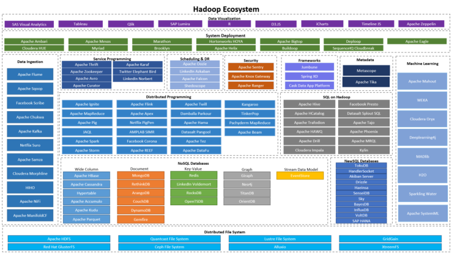
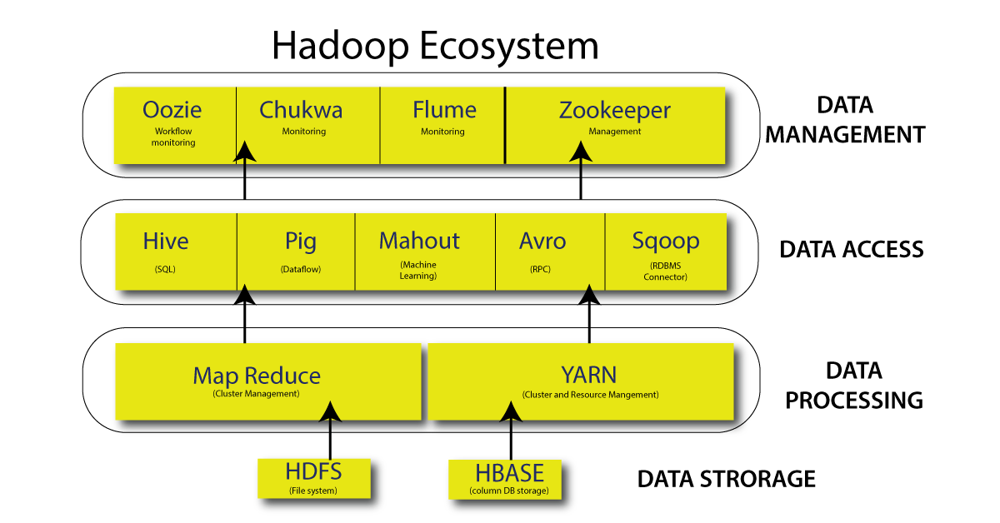

# Apache Hadoop

**Apache Hadoop** is a framework for running applications on large clusters built of commodity hardware. Hadoop is an open-source framework that allows for the distributed storage and processing of large datasets across clusters of computers. The Hadoop framework transparently provides applications for both reliability and data motion. 

Hadoop implements a computational paradigm named Map/Reduce, where the application is divided into many small fragments of work, each of which may be executed or re-executed on any node in the cluster. In addition, it provides a distributed file system (HDFS) that stores data on the compute nodes, providing very high aggregate bandwidth across the cluster. Both MapReduce and the Hadoop Distributed File System are designed so that node failures are automatically handled by the framework.


## Key Features
* Scalability: Able to handle petabytes of data.
* Fault tolerance: Data replication ensures that the system remains operational even if some nodes fail.
* Cost-effective: Utilizes commodity hardware.
* Flexibility: Supports structured, semi-structured, and unstructured data.
* Parallel processing: Efficient processing of large data sets by distributing the workload.


## History of Hadoop
### Early Beginnings and the Birth of Hadoop
* 2003: Apache Nutch
    * Origin of the Idea:
        - The journey of Hadoop started with the Apache Nutch project, an open-source web search software that was originally designed to crawl and index the web.
        - Nutch needed a scalable solution to store and process large amounts of data from the web, as traditional databases were not sufficient for the vast amount of unstructured data generated.
* 2005: The Birth of Hadoop
    * Doug Cutting and Mike Cafarella:
        - The idea to use distributed computing for Nutch was inspired by Google's MapReduce and Google File System (GFS) papers, which introduced a new way of processing large datasets across clusters of computers.
        - Doug Cutting (who was working at Yahoo! at the time) and Mike Cafarella (a PhD student at the University of Washington) began implementing a distributed storage and processing system that would later become Hadoop.
        - They borrowed key concepts from Google’s technologies but made them open source, aiming to provide the same scalability and fault tolerance that Google achieved for their large-scale data processing.
    * Naming the Project:
        - The project was named Hadoop after Cutting’s young son’s toy elephant, which symbolized the simplicity and robustness the system should exhibit.
### Apache Incubation and Hadoop’s Growth
* 2006: Apache Incubator
    * In 2006, Hadoop was moved to the Apache Software Foundation as an incubated project, which meant that it was officially being developed within the Apache community.
    * Apache, known for fostering open-source projects, was a perfect fit for Hadoop, as it could provide the community support, infrastructure, and governance needed for its growth.
* 2007: First Major Release
    * In 2007, Hadoop made its first major public release.
    * Initially, Hadoop only included a distributed file system (HDFS) and the MapReduce programming model, which were foundational components.
    * The Hadoop ecosystem at this stage was still in its infancy, and contributions from the community were beginning to increase.
* 2008: Early Adoption and Interest
    * Companies like Yahoo!, Facebook, and Amazon started showing interest in Hadoop due to its scalability and low cost.
    * Yahoo! was one of the first companies to adopt Hadoop at scale. They used it for processing web logs, and this proved that Hadoop could handle massive amounts of data on commodity hardware.
### Hadoop Matures (2009-2011)
* 2009: First Production Use
    * Yahoo! deployed Hadoop clusters with thousands of nodes. The ability to process massive amounts of data on inexpensive hardware made Hadoop a game-changer for enterprises.
    * Hadoop Distributed File System (HDFS) and MapReduce were the two primary components driving its success.
* 2011: Hadoop 1.0 Released
    * Hadoop 1.0 was officially released in 2011. This version included improvements to the MapReduce framework and HDFS, providing better stability and performance.
    * It was around this time that Hadoop became widely recognized as a leading solution for big data analytics and processing. Many companies in the tech and finance industries began adopting it for data warehousing, log processing, and other data-heavy tasks.
* Development of the Ecosystem:
    * As Hadoop matured, new projects began to emerge that enhanced its capabilities. Some of the key projects include:
    * Hive: A SQL-like query language for Hadoop, making it easier for data analysts to work with Hadoop.
    * Pig: A scripting language for processing and analyzing large datasets.
    * HBase: A NoSQL database built on top of HDFS for real-time random access to data.

### The Rise of YARN and Hadoop 2.x (2012-2014)
* 2012: Hadoop 2.x and the Introduction of YARN
    * In 2012, Hadoop 2.x was released, marking a major milestone in the evolution of the project. The most significant change was the introduction of YARN (Yet Another Resource Negotiator), a new resource management layer.
    * YARN decoupled resource management and job scheduling from the MapReduce framework, allowing for multiple processing frameworks to run on Hadoop clusters (e.g., MapReduce, Apache Spark, Tez).
    * This new architecture made Hadoop much more versatile, as it was no longer limited to just MapReduce for processing data.
    * Hadoop 2.x also improved fault tolerance, scalability, and flexibility in job execution, leading to better overall performance and resource utilization.

* Hadoop Becomes Enterprise Standard
    * As more companies adopted Hadoop and new tools like Apache Spark, Apache Flume, Sqoop, and Zookeeper joined the ecosystem, Hadoop became the de facto standard for handling big data.
    * Hadoop's ability to process both structured and unstructured data, store massive datasets on commodity hardware, and offer parallel processing at scale made it the backbone of the modern big data stack.
### The Rise of the Hadoop Ecosystem and Broader Adoption (2014-Present)
* 2014: The Hadoop Ecosystem Expands
    * The Hadoop ecosystem exploded in size and scope. Projects like Apache Hive, Apache HBase, Apache Oozie, and Apache Kafka became crucial components of the ecosystem.
    * Hadoop started supporting a variety of processing engines beyond MapReduce, including Apache Spark, which offered faster processing speeds and more flexibility.
    * Cloud Integration: Hadoop began to integrate with cloud platforms such as Amazon Web Services (AWS), Microsoft Azure, and Google Cloud, allowing companies to run Hadoop clusters on the cloud for easier management and scalability.
* 2015-Present: Hadoop in the Age of Data Lakes
    * Hadoop became a core component of data lakes, centralized repositories that store both structured and unstructured data at scale.
    * Tools like Apache Parquet, Apache ORC, and Apache Avro became widely used in conjunction with Hadoop to provide efficient columnar storage and serialization for data.
    * Companies like Cloudera, Hortonworks, and MapR emerged, providing commercial Hadoop distributions and services to manage, secure, and support large-scale Hadoop clusters.
* Hadoop’s Role in Machine Learning and Advanced Analytics
    * With the rise of machine learning and artificial intelligence, Hadoop’s ability to store and process large datasets made it a perfect platform for these emerging technologies.
    * Frameworks like Apache Mahout (for machine learning) and TensorFlow (integrating with Hadoop for big data processing) began to leverage Hadoop for big data-based AI and ML tasks.

## Hadoop Ecosystem
The Hadoop ecosystem is a collection of related tools and frameworks that work together to enable the distributed storage and processing of large datasets across clusters of machines. Hadoop, as an open-source project, was initially designed to process vast amounts of data in a fault-tolerant, scalable, and cost-efficient way. However, over time, as the need for more diverse functionalities grew, the ecosystem expanded with several complementary projects that enhanced Hadoop’s capabilities.

Ecosystem of Hadoop</img>

The Hadoop ecosystem comprises various projects and tools that solve different problems associated with big data. These tools work together to handle the entire lifecycle of big data, including data storage, data processing, data analysis, and data management.

* Distributed Storage: The Hadoop ecosystem allows you to store large volumes of data across many machines in a distributed manner.
* Distributed Processing: The ecosystem enables parallel data processing across nodes in the cluster, ensuring scalability and fault tolerance.
* Data Management and Integration: It provides tools for managing, integrating, and transferring data from various sources. 
* Data Analytics: Hadoop supports analytics tools for real-time and batch processing, enabling business intelligence, reporting, and machine learning.

</img>

### Key Components
1. **Hadoop Common**: 
    Hadoop Common, also known as core of Apache Hadoop, is a widely-used open-source framework designed for distributed storage and processing of large data sets. Hadoop Common is a core component of the Apache Hadoop framework, providing essential libraries and utilities for the proper functioning of the Hadoop ecosystem. 
    * It offers various modules, including IO, RPC, and serialization, that enable developers to focus on building robust, distributed systems. Furthermore, Hadoop Common supports other Hadoop components, such as Hadoop Distributed File System (HDFS), Hadoop YARN, and Hadoop MapReduce.
    * The primary purpose of Hadoop Common is to provide an essential set of tools, libraries, and Java APIs that facilitate the functionality of other Hadoop modules, such as Hadoop Distributed File System (HDFS), MapReduce, and YARN. 
    * It provides the necessary Java Archive (JAR) files and scripts needed to start and run Hadoop, ensuring seamless interaction and communication between its components. Among its key features, Hadoop Common includes the Hadoop FileSystem API, enabling data storage system integration, as well as the Hadoop Distributed File System (HDFS).
    * By streamlining the creation, organization, and processing of software across various Hadoop modules, Hadoop Common aims to enable seamless communication and data transfer between the nodes of a Hadoop cluster, thereby contributing to the efficient operation of Hadoop in its entirety. In order to fulfill its function of fostering communication and enhancing the performance of Hadoop, Hadoop Common is used for a range of practical purposes.
    * For instance, developers working with data-intensive applications often employ Hadoop Common to manage their software utilities, as the component provides support for critical processes involving source code compilation, serialization, and deserialization. Moreover, the module’s native libraries contribute to the prompt execution of tasks, helping users to exploit comprehensive records from large datasets.

2. **Hadoop Distributed File System (HDFS):**
    HDFS is the storage layer of Hadoop. It is a distributed file system designed to store vast amounts of data across a cluster of commodity hardware. HDFS is highly fault-tolerant and is designed to be deployed on low-cost hardware. HDFS provides high throughput access to application data and is suitable for applications that have large data sets. HDFS relaxes a few POSIX requirements to enable streaming access to file system data. HDFS was originally built as infrastructure for the Apache Nutch web search engine project. HDFS is part of the Apache Hadoop Core project.
    
    Core Feature of HDFS includes:
    * Fault Tolerance: Data in HDFS is divided into blocks (usually 128 MB or 256 MB in size) and replicated across multiple nodes to prevent data loss in case of node failure.
    * Scalability: HDFS is designed to scale horizontally by adding more nodes to the cluster.
    * High Throughput: HDFS is optimized for high throughput rather than low latency, making it ideal for large-scale data processing.
    * Write Once, Read Many Model: HDFS is optimized for scenarios where data is written once and read multiple times, such as log processing, web analytics, and data warehousing.

3. **MapReduce:**
MapReduce is a programming model and computational framework for processing large datasets in parallel across a Hadoop cluster. Map Reduce includes:

    * Map Phase: The input data is split into smaller chunks, which are processed in parallel by the Mapper. Each mapper takes a chunk, processes it, and outputs intermediate key-value pairs.
    * Shuffle and Sort: The intermediate key-value pairs are shuffled, sorted, and grouped by the key. This step ensures that all data with the same key is brought together.
    * Reduce Phase: The Reducer processes the grouped data and produces the final output.

4. **YARN:**
YARN is the resource management and job scheduling layer of Hadoop, introduced in Hadoop 2.x to improve resource utilization and cluster management.

    * ResourceManager: The master daemon responsible for managing the cluster’s resources and allocating them to different jobs.
    * NodeManager: A per-node daemon that monitors resource usage (CPU, memory, disk) on each node and reports it to the ResourceManager.
    * ApplicationMaster: Manages the execution of a single job within the cluster, ensuring that resources are allocated appropriately.

## Hadoop Deamons
Hadoop daemons are background processes that manage the distributed storage and processing in a Hadoop cluster. Here's a detailed breakdown of the core daemons:

**HDFS (Storage Layer) Daemons:**

1. NameNode:
Role: Master node managing HDFS metadata (file system tree, block locations, permissions).
Functionality:
Tracks DataNode health via heartbeats and block reports.
Directs clients to DataNodes for read/write operations.
Critical single point of failure (SPOF) in non-HA setups.
Location: Runs on the master node.

2. DataNode:
* Role: Worker node storing actual data blocks.
* Functionality:
    * Stores and retrieves data blocks as instructed by the NameNode or clients.
    * Sends periodic heartbeats and block reports to the NameNode.
    * Location: Runs on all worker nodes.

3. Secondary NameNode:
* Role: Helper to the NameNode (not a backup or HA solution).
* Functionality:
    * Periodically merges the `fsimage` (metadata snapshot) with edits (transaction log) to reduce NameNode restart time.
    * Runs checkpointing tasks to prevent edit log overflow.
    * Location: Typically runs on a separate machine.

**YARN (Processing Layer) Daemons:**

4. ResourceManager (RM):
* Role: Master node managing cluster resources and scheduling.
* Functionality:
    * Scheduler: Allocates resources to running applications (e.g., CPU, memory).
    * ApplicationsManager: Accepts job submissions, starts ApplicationMasters, and handles failures.
    * Location: Runs on the master node.

5. NodeManager (NM):
* Role: Worker node agent for resource management.
* Functionality:
    * Manages containers (execution environments for tasks).
    * Monitors resource usage (CPU, memory) and reports to the ResourceManager.
    * Kills containers exceeding resource limits.
    * Location: Runs on all worker nodes (salve systems).

6. Job History Server:
* Role: Logs and tracks completed jobs.
* Functionality:
    * Stores historical data (logs, metrics) for MapReduce or YARN applications.
    * Essential for debugging and auditing.
    * Location: Runs on a dedicated or master node.

# Hadoop Configuration Modes

Hadoop primarily operates in three modes, each tailored for specific use cases:

---

## **1. Standalone Mode**  
### **Overview**  
- Purpose: Used for deveopment/testing on a single machine
- **Daemons Running**: All processes (e.g., MapReduce jobs) run in a single JVM. 
- **Setup**: Installed on a **single machine** with no cluster configuration.  

### **Key Characteristics**  
- **Speed**: Fastest mode due to no distributed overhead.  
- **Storage**: Uses the **local filesystem** (e.g., NTFS, FAT32) instead of HDFS.  
- **Configuration Files**:  
  - No need to configure `hdfs-site.xml`, `mapred-site.xml`, or `core-site.xml`.  
- **Process Execution**:  
  - All tasks run within a **single JVM (Java Virtual Machine)**.  
  - Ideal for small-scale development, testing, or debugging.  

### **Use Cases**  
- Learning Hadoop basics.  
- Unit testing or debugging MapReduce jobs.  

---

## **2. Pseudo-Distributed Mode (Single-Node Cluster)**  
### **Overview**  
- **Daemons Running**: All Hadoop daemons (Namenode, Datanode, ResourceManager, NodeManager, Secondary NameNode) run as **separate processes** on a single machine.  
- **Cluster Simulation**: Simulates a multi-node cluster on one machine.  

### **Key Characteristics**  
- **HDFS Usage**: Enabled for input/output operations.  
- **Replication Factor**: Set to `1` (single copy of data blocks).  
- **Configuration Files**:  
  - Modify:  
    - `core-site.xml`: Set `fs.defaultFS` to `hdfs://localhost:9000`.  
    ```<!-- core-site.xml -->
    <property>
    <name>fs.defaultFS</name>
    <value>hdfs://localhost:9000</value> <!-- HDFS on localhost -->
    </property>
    ```
    - `hdfs-site.xml`: Configure `dfs.replication=1`.  
    ```
    <!-- hdfs-site.xml -->
    <property>
    <name>dfs.replication</name>
    <value>1</value> <!-- Replication factor = 1 -->
    </property>
    ```
    - `yarn-site.xml`: Enable `mapreduce_shuffle` for YARN.  
    ```
    <!-- yarn-site.xml -->
    <property>
    <name>yarn.nodemanager.aux-services</name>
    <value>mapreduce_shuffle</value>
    </property>
    ```
- **Process Execution**:  
  - Each daemon runs in its own JVM.  
  - Master/Slave roles:  
    - **Master**: Namenode, ResourceManager.  
    - **Slave**: Datanode, NodeManager.  
    - **Secondary NameNode**: Periodically merges metadata (not a backup).  

### **Use Cases**  
- Debugging distributed workflows.  
- Learning cluster behavior on limited hardware.  

---

## **3. Fully Distributed Mode (Multi-Node Cluster)**  
### **Overview**  
- **Daemons Running**:  
  - **Master Nodes**: Namenode, ResourceManager (and optionally Secondary NameNode).  
  - **Worker Nodes**: Datanode, NodeManager.  
- **Production-Ready**: Designed for large-scale data processing.  

### **Key Characteristics**  
- **HDFS**:  
  - Data blocks are distributed across multiple nodes.  
  - Default replication factor: `3`.  
- **Configuration Files**:  
  - **Master Nodes**: Define `fs.defaultFS` (HDFS URI) in `core-site.xml`.  
  ```
    <!-- core-site.xml -->
    <property>
    <name>fs.defaultFS</name>
    <value>hdfs://namenode-host:9000</value>
    </property>

    <!-- hdfs-site.xml -->
    <property>
    <name>dfs.replication</name>
    <value>3</value>
    </property>
    <property>
    <name>dfs.namenode.name.dir</name>
    <value>/path/to/namenode/data</value>
    </property>
  ```
  - **Worker Nodes**: Configure `dfs.datanode.data.dir` (block storage paths).  
  ```
    <!-- hdfs-site.xml -->
    <property>
    <name>dfs.datanode.data.dir</name>
    <value>/path/to/datanode/data</value>
    </property>

    <!-- yarn-site.xml -->
    <property>
    <name>yarn.resourcemanager.hostname</name>
    <value>resourcemanager-host</value>
    </property>
  ```
- **Cluster Setup**:  
  - Extract Hadoop installation (tar/zip) on **all nodes**.  
  - Assign roles:  
    - Dedicate nodes for masters (e.g., Namenode, ResourceManager).  
    - Use worker nodes for storage/compute (Datanode, NodeManager).  

### **Use Cases**  
- Enterprise-level data processing.  
- Handling petabytes of data across hundreds of nodes.  

---

## **Comparison Table**  
| **Feature**               | **Standalone Mode**       | **Pseudo-Distributed Mode** | **Fully Distributed Mode** |  
|---------------------------|---------------------------|-----------------------------|----------------------------|  
| **Daemons Active**         | ❌                        | ✅                          | ✅                          |  
| **HDFS Usage**             | ❌                        | ✅                          | ✅                          |  
| **Replication**            | ❌                        | 1                           | 3 (configurable)           |  
| **Nodes Required**         | 1                         | 1                           | ≥3                         |  
| **Use Case**               | Testing/Debugging         | Learning/Simulation         | Production                 |  

---

## **Additional Notes**  
1. **Secondary NameNode**:  
   - Not a backup node. Merges `fsimage` and `edits` logs to prevent NameNode bottlenecks.  
2. **Hadoop 2.x/3.x vs. 1.x**:  
   - Hadoop 1.x uses JobTracker/TaskTracker (deprecated).  
   - Hadoop 2+/3+ uses YARN (ResourceManager/NodeManager) for resource management.  
3. **Advanced Modes**:  
   - **High Availability (HA)**: Eliminates SPOF (Single Point of Failure) using standby NameNodes and ZooKeeper.  
   - **Federated HDFS**: Scales metadata across multiple NameNodes for ultra-large clusters.  

---

## **Configuration Snippets**  
### **Pseudo-Distributed Mode Example**  
```xml
<!-- core-site.xml -->
<property>
  <name>fs.defaultFS</name>
  <value>hdfs://localhost:9000</value>
</property>

<!-- hdfs-site.xml -->
<property>
  <name>dfs.replication</name>
  <value>1</value>
</property>
```

# Advanced Hadoop Modes: HA & Federation

---

## **1. High Availability (HA) Mode**  
### **Overview**  
Eliminates single points of failure (SPOF) in Hadoop clusters by providing redundancy for critical components like the **NameNode** and **ResourceManager**.  

### **Key Components**  
- **HDFS HA**:  
  - **Active/Standby NameNodes**:  (handled by zookeeper)
    - **Active NameNode**: Handles client requests.  
    - **Standby NameNode**: Takes over during failover (automated via ZooKeeper).  
  - **JournalNodes**:  
    - Store shared edit logs (`edits`) for metadata synchronization between NameNodes.  
    - Requires **3+ JournalNodes** for quorum.  
  - **ZooKeeper**:  
    - Coordinates failover and monitors NameNode health.  

- **YARN HA**:  
  - **Active/Standby ResourceManagers**:  
    - Standby ResourceManager becomes active if the primary fails.  
  - **ZooKeeper**: Manages ResourceManager state and failover.  

### **Configuration Snippets**  
#### **HDFS HA** (`hdfs-site.xml`):  
```xml
<property>
  <name>dfs.nameservices</name>
  <value>mycluster</value>
</property>
<property>
  <name>dfs.ha.namenodes.mycluster</name>
  <value>nn1,nn2</value> <!-- Active & Standby NameNodes -->
</property>
<property>
  <name>dfs.namenode.shared.edits.dir</name>
  <value>qjournal://journalnode1:8485;journalnode2:8485;journalnode3:8485/mycluster</value>
</property>
<property>
  <name>dfs.ha.automatic-failover.enabled</name>
  <value>true</value> <!-- ZooKeeper-managed failover -->
</property>
```
#### **YARN HA** (`yarn-site.xml`):  
```xml
<property>
  <name>yarn.resourcemanager.ha.enabled</name>
  <value>true</value>
</property>
<property>
  <name>yarn.resourcemanager.ha.rm-ids</name>
  <value>rm1,rm2</value>
</property>
```
## **2. Federation Mode (HDFS Federation)**

### Overview
Scales HDFS metadata horizontally by splitting it across multiple independent NameNodes, each managing a separate namespace. It is designed to address the limitations of a single NameNode in large-scale Hadoop clusters.

### **Key Components**
* Namespaces:
    - Each NameNode manages its own namespace (e.g., /sales, /logs).
    - No cross-namespace communication.
    - For example, NameNode 1 handles /user namespace, NameNode 2 manages /data namespace.
* Block Pools:
    - Data blocks are stored in pool directories on DataNodes.
    - Each namespace has its own block pool.
* ViewFS:
    - Clients use a unified namespace (e.g., hdfs://cluster/) to access federated namespaces.

```xml
<property>
  <name>dfs.nameservices</name>
  <value>ns1,ns2</value> <!-- Namespaces -->
</property>
<property>
  <name>dfs.namenode.rpc-address.ns1</name>
  <value>namenode1-host:8020</value>
</property>
<property>
  <name>dfs.namenode.rpc-address.ns2</name>
  <value>namenode2-host:8020</value>
</property>
<property>
  <name>dfs.client.failover.proxy.provider.ns1</name>
  <value>org.apache.hadoop.hdfs.server.namenode.ha.ConfiguredFailoverProxyProvider</value>
</property>
```

### When to Use Federation?
* Massive Metadata:	Clusters with 100M+ files where a single NameNode’s memory/CPU is overwhelmed.
* Workload Isolation:	Separate production, analytics, and test data into distinct namespaces.
* Multi-Tenancy:	Assign dedicated namespaces to different teams or applications.
* Geographic Distribution:	Manage data across regions with separate namespaces.

# Hadoop Streaming
* Hadoop Streaming allows you to run MapReduce jobs using any executable (e.g., Python, Ruby, or Bash scripts) as the mapper and/or reducer. 
* This is useful for non-Java developers or for quick prototyping. Here's how to use it on your macOS Hadoop setup:

## Prerequisities
1. Hadoop is installed and running (HDFS/YARN services are up).
2. Input data is stored in HDFS.
3. Mapper and reducer scripts are written (e.g., in Python).

## Example
* mapper.py
```python
#!/usr/bin/env python3
import sys

for line in sys.stdin:
    line = line.strip()
    words = line.split()
    for word in words:
        print(f"{word}\t1")
```
* reducer.py
```
#!/usr/bin/env python3
import sys

current_word = None
current_count = 0

for line in sys.stdin:
    line = line.strip()
    word, count = line.split("\t", 1)
    count = int(count)

    if current_word == word:
        current_count += count
    else:
        if current_word:
            print(f"{current_word}\t{current_count}")
        current_word = word
        current_count = count

if current_word:
    print(f"{current_word}\t{current_count}")
```

Use the hadoop-streaming JAR file to run the streaming job
```bash
hadoop jar \
  /usr/local/Cellar/hadoop/<version>/libexec/share/hadoop/tools/lib/hadoop-streaming-*.jar \
  -files mapper.py,reducer.py \
  -mapper mapper.py \
  -reducer reducer.py \
  -input /user/$(whoami)/input/* \
  -output /user/$(whoami)/output
```